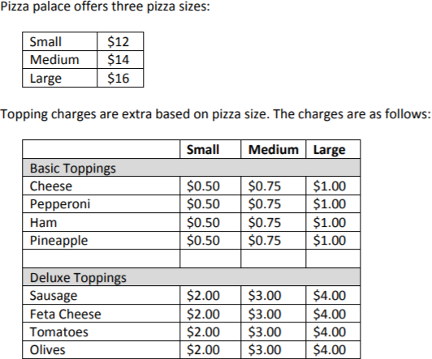

# Pizza Palace Billing System

A billing system for Pizza Palace that records an order and generates an itemized receipt for the order.

The GST (5% - Goods and Services Tax) is calculated on the order (rounded up to the nearest cent).

***

The input is in the following format:

    Size - Topping, Topping, Topping, ...

***

Example:

*Input*:

    Large - Pepperoni, Cheese,
    Medium - Pepperoni, Cheese
    Small - Pepperoni, Cheese

*Output*:

    1 Large, Two Topping Pizza - Pepperoni and Cheese: $18.00

    1 Medium, Two Topping Pizza - Pepperoni and Cheese: $15.50
    1 Small, Two Topping Pizza - Pepperoni and Cheese: $13.00

    Subtotal: $46.50
    GST: $2.33
    Total: $48.83