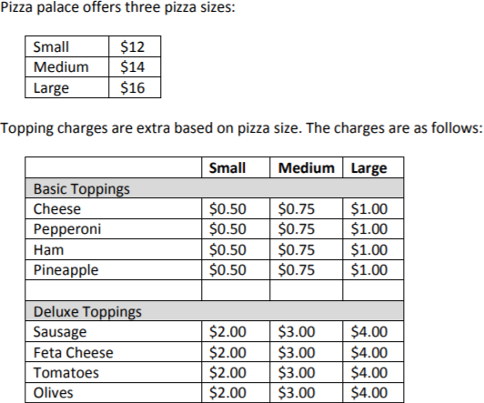

# Pizza Palace Billing System 

A billing system for Pizza Palace that records an order and generates an itemized receipt for the order.

The GST (5% - Goods and Services Tax) is calculated on the order (rounded up to the nearest cent).

---

The input is in the following format:

    Size - Topping, Topping, Topping, ...

---

Usage (node.js@14.15.4 and npm@6.14.10):

    $ npm run start

---

Simple Example:

_Input_:

    Large - Pepperoni, Cheese,
    Medium - Pepperoni, Cheese
    Small - Pepperoni, Cheese

_Output_:

    1 Large, Two Topping Pizza - Cheese and Pepperoni: $18.00
    1 Medium, Two Topping Pizza - Cheese and Pepperoni: $15.50
    1 Small, Two Topping Pizza - Cheese and Pepperoni: $13.00

    Subtotal: $46.50
    GST: $2.33
    Total: $48.83

---

More Complex Example:

_Input_:

    Large - Pepperoni, Cheese,
    Large -  Cheese, Pepperoni
    Medium -  Pepperoni , Cheese, Olives
    Medium -    pepperoni , olives, Cheese
    Small -Pepperoni,Cheese
    Small -  Pepperoni,Cheese
    Small -    Pepperoni,Cheese
    Small -Cheese

_Output_:

    2 Large, Two Topping Pizza - Cheese and Pepperoni: $36.00
    2 Medium, Three Topping Pizza - Cheese, Olives and Pepperoni: $37.00
    3 Small, Two Topping Pizza - Cheese and Pepperoni: $39.00
    1 Small, One Topping Pizza - Cheese: $12.50

    Subtotal: $124.50
    GST: $6.23
    Total: $130.73
